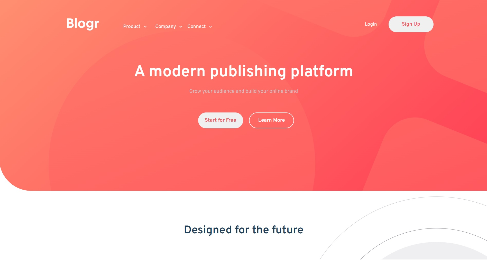

## Índice

- [Visão geral](#visão-geral)
   - [Captura de tela](#captura-de-tela)
   - [Links](#links)
- [Meu processo](#meu-processo)
   - [Construído com](#construído-com)
   - [O que aprendi](#o-que-aprendi)
   - [Desenvolvimento contínuo](#desenvolvimento-contínuo)
   - [Recursos úteis](#useful-resources)

## Visão geral

### Captura de tela



### Links

 - URL do site: [Link do projeto](projeto-blogr.netlify.app)

## Meu processo

### Construído com

- Marcação HTML5 semântica
- Propriedades personalizadas CSS
- Flexbox
- JavaScript

### O que eu aprendi

Neste projeto eu pude montar um menu dropdow, estilizando no css eu tive contatos com mais algumas propriedades do background, e transform. E a utilização de JavaScript, para que após clicar no menu de navegação, o submenu aparecesse e o icone invertece. 

```html
<ul class="product">
          <li class="li-p">

             <a class="bt1" href="#">Product</a>

                <ul id="ul-product" class="submenu">
                  <li><a class="ul-link" href="#">Overview</a></li>
                  <li><a class="ul-link" href="#">Pricing</a></li>
                  <li><a class="ul-link" href="#">Marketplace</a></li>
                  <li><a class="ul-link" href="#">Features</a></li>
                  <li><a class="ul-link" href="#">Integrations</a></li>
                </ul>
          
          </li>
```

```css
header div.cabecalho{
  width: 100%;
  height: 600px;
  border-radius: 0 0 0 100px;
  background-image: url("../images/bg-pattern-intro-desktop.svg"), linear-gradient(138deg, #ff8f70,  #ff3d54);
  background-size: 220%, 100%;
  background-position: 26% 52%, 0% 0%;
  background-repeat: no-repeat;
}

li.li-p a.bt1 img.icon.reverse{
  -moz-transform: scaleY(-1);
  -o-transform: scaleY(-1);
  -webkit-transform: scaleY(-1);
  transform: scaleY(-1);
}
}
```
```js
document.addEventListener('click', (e) => {
    const isDropdownBtn = e.target.classList.contains('bt1') || e.target.classList.contains('icon') ;

   if (!isDropdownBtn && e.target.closest('.li-p') != null ) return;

   let currentSubmenu

   let currentIcon

   if(isDropdownBtn){
    const item = e.target.closest('.li-p')

    currentSubmenu = item.querySelector('.submenu')

    currentSubmenu.classList.toggle('show')

    currentIcon = item.querySelector('.icon')

    currentIcon.classList.toggle('reverse')
   }

   document.querySelectorAll('.submenu.show').forEach((submenu) => {
    if(submenu == currentSubmenu) return;

    submenu.classList.remove('show');

   });

   document.querySelectorAll('.icon.reverse').forEach((reverse) => {
    if(reverse == currentIcon) return;

    reverse.classList.remove('reverse');
   });

} );
```

### Desenvolvimento contínuo

  Ao termino desse projeto, eu pretendo realizar outro projeto que obtenha formulario, e validação com JavaScript, uma tecnologia que ainda nao estou habituado a mexer.

### Recursos úteis

- [Regra trasnform](https://horadecodar.com.br/2020/05/15/como-inverter-uma-imagem-com-css-espelhar-flip/) - Esse artigo me ajudou para que eu pudesse, fazer o icone light, inverter. 
- [Menu Dropdown](https://www.youtube.com/watch?v=1L50KvRK2Ic&t=1076s) - Este é um video bem explicativo de como fazer um menu dropdown com a utilização de javascript

